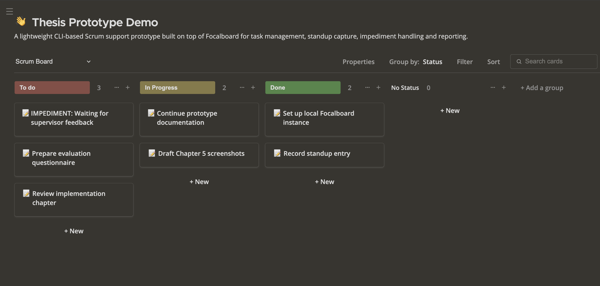

# Lightweight CLI-Based Scrum Support Prototype with Focalboard

This project is a lightweight command-based Scrum support prototype built on top of a self-hosted Focalboard instance.  
It provides a simple CLI interface for common Scrum-related actions such as task creation, task updates, standup capture, impediment management, reporting and CSV exports.

The prototype is developed as part of a master's thesis exploring communication-centric and lightweight tool support for Scrum-based work in educational settings.

## Board Overview



---

## Overview

The system extends a local Focalboard setup with a CLI layer that allows users to interact with Scrum-related board content through short terminal commands.

Implemented capabilities include:

- task creation
- task listing and search
- task status and priority updates
- note attachment to cards
- impediment creation
- impediment resolution
- standup entry capture
- standup reporting
- impediment reporting
- summary reporting
- CSV export of logs

The focus of the prototype is not to replace full project management platforms, but to demonstrate a lightweight interaction model that can support essential Scrum workflows with minimal setup.

---

## Main Features

### 1. Task operations
The CLI supports creation and update of board cards through simple commands.

Examples:
- create a task
- create a quick to-do item
- create a quick in-progress item
- move a card between statuses
- update priority
- mark a card as done
- delete a card

### 2. Notes on cards
Notes can be attached to existing cards using a command-based workflow.

### 3. Impediment handling
The prototype supports a simple impediment lifecycle:
- create impediment cards
- view impediments
- resolve impediments
- report open and resolved impediments

### 4. Standup support
The system provides a standup command that captures:
- what was done yesterday
- what will be done today
- blockers

Standup entries are logged and can be reviewed through reporting commands.

### 5. Reporting
The prototype includes several lightweight reporting functions:
- recent activity report
- standup history report
- impediment report
- open impediment view
- today’s activity report
- summary report

### 6. CSV export
Log-based reports can be exported to CSV files for later inspection and documentation.

---

## Project Structure

Typical important files in this project are:

- `fb`  
  Small wrapper script that forwards commands to `fb.sh`

- `fb.sh`  
  Main CLI command router

- `fb_add_v1.sh`  
  Creates new cards in Focalboard

- `fb_list.py`  
  Lists and filters cards from the board

- `fb_update.py`  
  Updates card status/priority or deletes a card

- `fb_note.py`  
  Adds a note to a card

- `fb_standup.py`  
  Handles standup workflow

- `fb_log.py`  
  Writes action logs to `logs/actions.jsonl`

- `fb_report.py`  
  Provides reporting and CSV export

- `fb_impediments.py`  
  Lists impediment cards

- `docker-compose.yml`  
  Starts the local Focalboard instance

- `logs/`  
  Stores action logs and exports

---

## Prerequisites

Before using the prototype, please make sure the following are available:

- macOS or Linux environment
- Python 3
- Docker and Docker Compose
- a running local Focalboard instance
- valid board and authentication configuration in `.env`

---

## Setup

### 1. Start Focalboard

Start the local Focalboard server using Docker Compose:

```bash id="readme_cmd_1"
docker compose up -d


Then open the board in your browser:
http://localhost:8000


### 2. Configure environment variables

Create a `.env` file in the project folder. This file stores the local configuration values needed by the scripts to connect to the Focalboard instance and the target board.

Typical values include:

- Focalboard base URL
- authentication token
- board id
- parent block id
- property ids and option ids used by the scripts

Because these values are specific to the local setup, they should not be committed to a public repository. Sensitive files such as `.env`, cookies, or session-related files should be kept private.


### 3. Make scripts executable

chmod +x fb fb.sh fb_log.py fb_report.py fb_standup.py


### 4. Create tasks

./fb add "Prepare thesis screenshots" --status todo --priority high
./fb todo "Write methodology section"
./fb prog "Continue implementation testing"


### 5. List and search

Board items can be listed or filtered through simple commands.

./fb list --limit 10
./fb search "thesis"


## 6. Update cards

Existing cards can be updated by changing their status or priority, marking them as done or deleting them if they are no longer needed.

./fb move CARD_ID --status done --priority high
./fb done CARD_ID
./fb high CARD_ID
./fb low CARD_ID
./fb delete CARD_ID


## 7. Add notes

A note can be attached to an existing card by passing the card id and note text.

./fb note CARD_ID "Reviewed and updated."


## 8. Impediments

Impediments can be created, listed, and resolved through dedicated commands.

./fb imp "Waiting for supervisor feedback"
./fb impediments
./fb resolve CARD_ID "Resolved: feedback received"


## 9. Standup

A standup entry can be recorded interactively through the standup command.

./fb standup


## 10. Reports

Different reports are available for reviewing recent activity, standups, impediments, and summary information.

./fb report activity --last 10
./fb report standup --last 5
./fb report impediments
./fb report impediments --open
./fb report today
./fb report summary


## 11. Export

Report data can be exported to CSV files through the export command.

./fb export --type activity
./fb export --type standup
./fb export --type impediments


## Workflow
A typical workflow with the prototype starts with creating a task, moving it to in progress, and attaching a note if needed. If work is blocked, an impediment can be created. A standup entry can then be recorded to capture progress and blockers. Once the issue is cleared, the impediment can be resolved. Finally, reports can be generated and exported to CSV for later review.


## Logging
The prototype keeps a local action log in:

logs/actions.jsonl
The log records actions such as task creation, task movement, notes, impediments, standups, resolutions, and deletions. These log entries are later used as the basis for reporting and CSV export.


